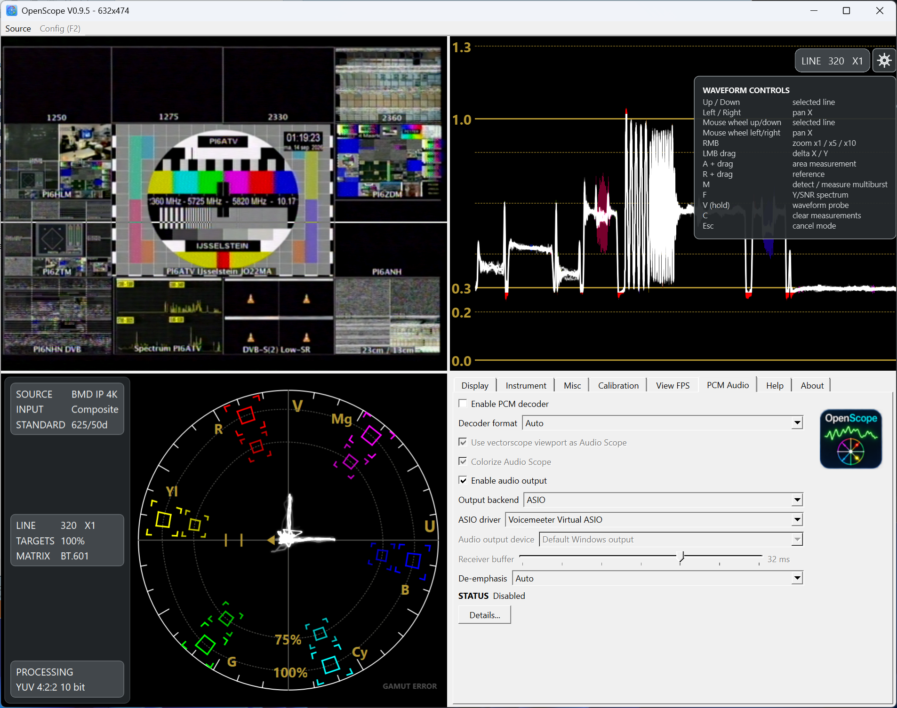
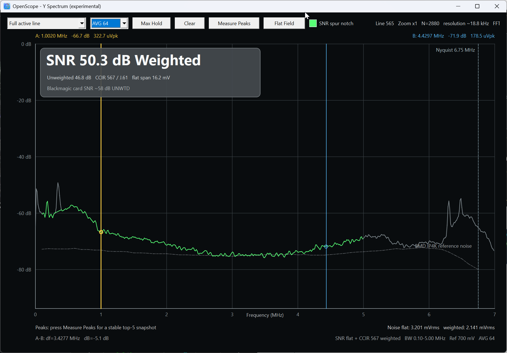
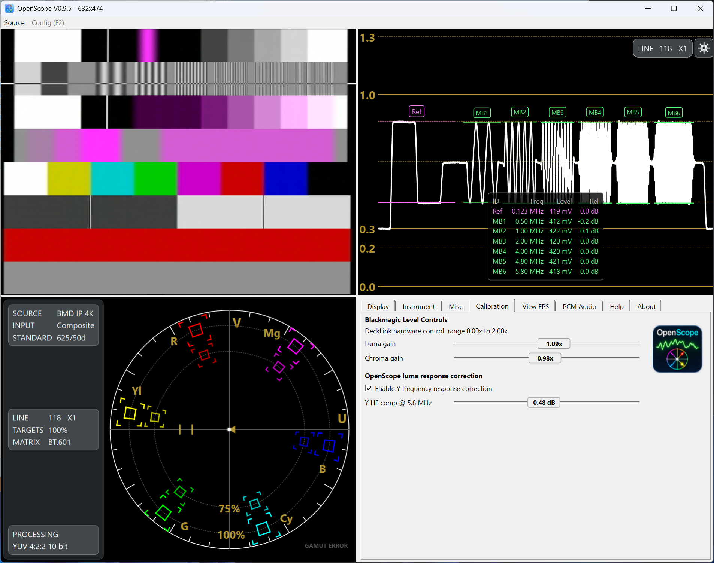
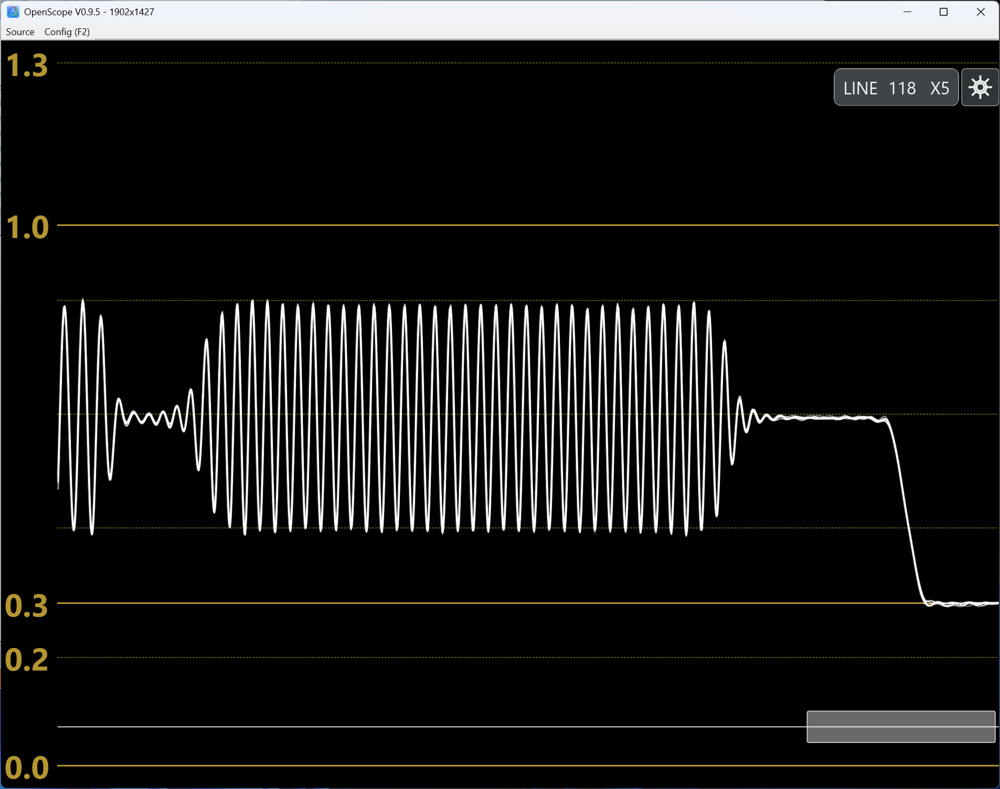
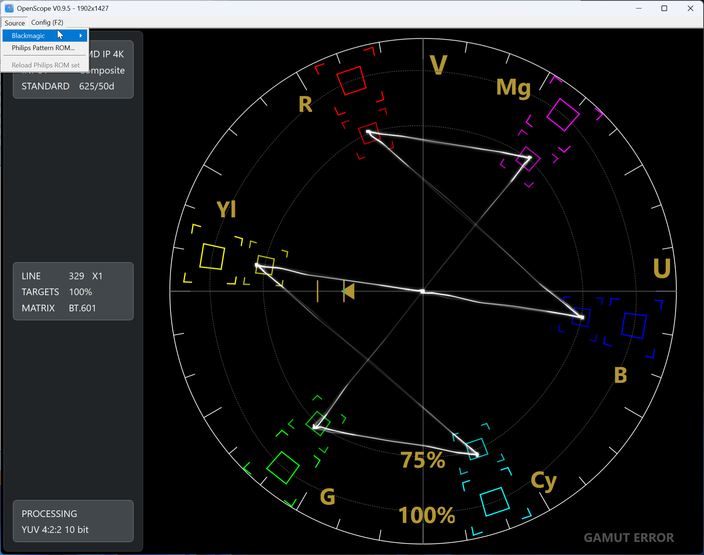
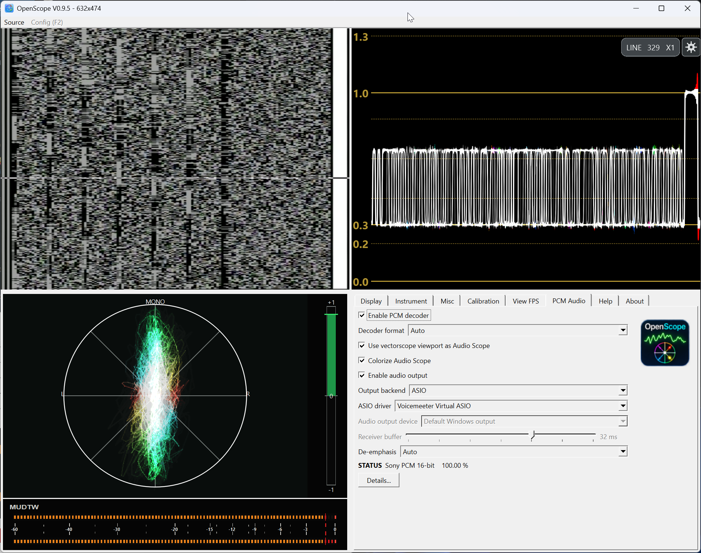
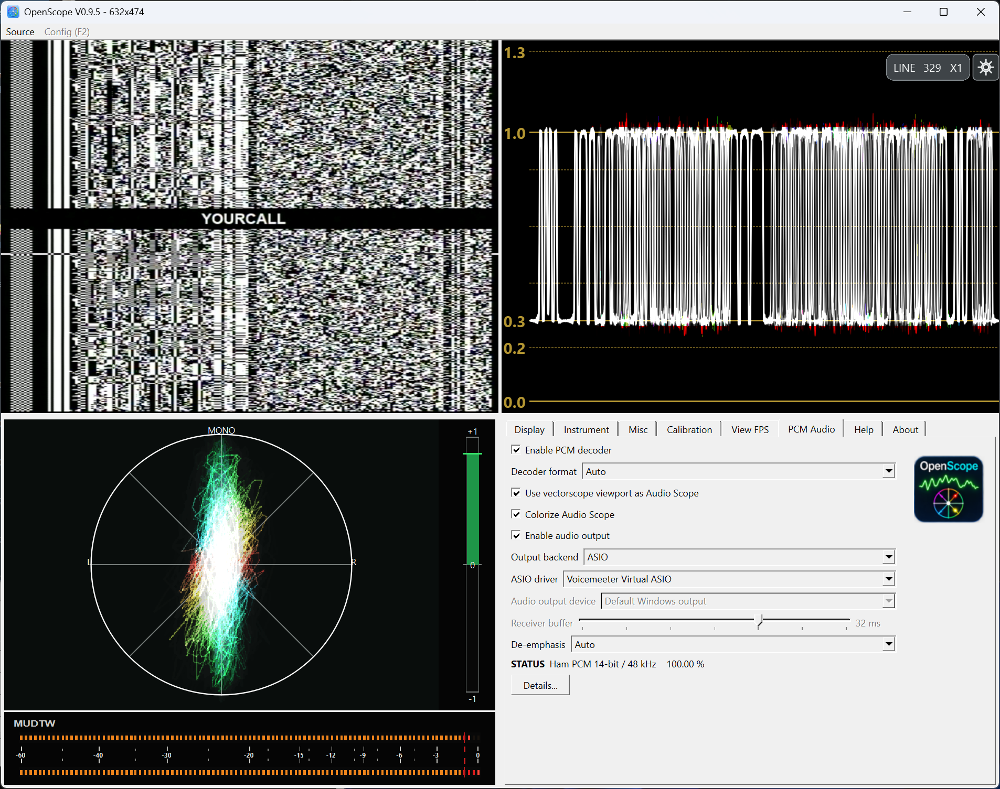

# OpenScope

OpenScope is a Windows-based software waveform monitor, vectorscope and video analysis toolbox focused on PAL/625-line SD video.

The current public baseline is **OpenScope 0.9.6**.



OpenScope can combine live video, waveform, vectorscope and configuration or PCM-audio views in a four-panel workspace.

## Features

- PAL/625-line video capture and display
- Waveform monitor
- Vectorscope
- Fullscreen and multi-view workspace
- Spout output for video, waveform and vectorscope
- WSS decoding with optional automatic 4:3 / 16:9 aspect-ratio following
- Illegal-luminance and gamut-error indication
- Blackmagic DeckLink / Intensity device selection
- Support for systems with multiple Blackmagic capture devices
- Blackmagic input level controls
- Luminance frequency-response correction
- Selected-line analysis
- Multiburst measurement
- Experimental Y-spectrum and SNR analysis
- Sony PCM-F1 / EIAJ PCM decoding
- Ham PCM 2.0 decoding
- PCM Audio Scope with:
  - left/right level metering
  - stereo phase / goniometer display
  - MUDTW metering
- WASAPI decoded-audio output
- ASIO decoded-audio output
- Performance and worker timing diagnostics

## Screenshots

### Y Spectrum and SNR analysis



Experimental Y-spectrum analysis provides frequency-domain inspection of the active video line, including weighted and unweighted SNR measurement, averaging, peak markers, max hold and reference-noise comparison.

### Multiburst and frequency-response measurement



OpenScope can analyse multiburst test signals directly from a selected video line, reporting individual burst frequencies, measured levels and deviation from a reference. The same view can be used while adjusting Blackmagic input gain and optional luminance frequency-response correction.

### Waveform zoom and detailed line inspection



The waveform monitor supports horizontal zoom and panning for detailed inspection of a selected video line while keeping the vertical scale fixed. This makes it possible to inspect fine high-frequency detail without losing the calibrated amplitude reference.

### Vectorscope



The vectorscope supports selected-line analysis, 75% / 100% targets, BT.601 processing and gamut-error indication.

### Sony PCM decoding and Audio Scope



OpenScope can decode PCM audio embedded in video and monitor the result with a dedicated Audio Scope, stereo phase / goniometer display and MUDTW level meters. Decoded audio can be sent through WASAPI or ASIO.

### Ham PCM decoding



OpenScope also supports Ham PCM 2.0. This view shows live 14-bit / 48 kHz decoding with decoder status, waveform monitoring, Audio Scope, MUDTW metering and ASIO output.

## Supported video hardware

OpenScope currently targets Blackmagic Design capture hardware through the DeckLink SDK.

To use Blackmagic capture hardware, install the current **Blackmagic Desktop Video** software and driver package from Blackmagic Design.

The application is designed to remain usable when no Blackmagic driver or capture device is available, so non-capture functionality can still be accessed.

## WSS and aspect ratio

OpenScope includes WSS decoding for 625-line sources.

When enabled, OpenScope can follow the transmitted aspect-ratio information automatically:

- stable 4:3 material remains 4:3;
- anamorphic 16:9 signalling can switch the video display to 16:9;
- loss of WSS restores the user's stored manual aspect-ratio selection.

## PCM audio

OpenScope can decode PCM embedded in video, including Sony PCM-F1 / EIAJ-style signals and Ham PCM 2.0.

Decoded audio can be monitored through the built-in PCM Audio Scope and sent to either:

- WASAPI
- ASIO

Sony PCM/EIAJ audio uses a 44.1 kHz source rate. Ham PCM 2.0 uses 48 kHz.

## ASIO

OpenScope supports ASIO using the Steinberg ASIO SDK.

The Steinberg ASIO SDK is **not distributed with OpenScope** and must be obtained separately from Steinberg.

CMake can locate the SDK through `ASIO_SDK_ROOT` or a supported common SDK location.

The selected SDK root must contain at least:

```text
common/asio.cpp
host/asiodrivers.cpp
host/pc/asiolist.cpp
```

ASIO is a trademark or registered trademark of Steinberg Media Technologies GmbH, registered in Europe and other countries.

## Philips ROM sets

OpenScope can use external Philips PM5644 ROM sets for supported test-pattern and reference functions.

The ROM layout and model-specific configuration files in `romsets/` are part of OpenScope and are included in the repository. These `.ini` files describe how OpenScope should interpret the corresponding ROM contents.

The actual Philips ROM images are **not distributed with OpenScope**.

Users must provide their own legally obtained ROM dumps and place the required `.bin` files in the appropriate subdirectory under `romsets/`.

For example:

```text
romsets/
├── PM5644G00/
│   ├── PM5644G00.ini
│   └── <ROM image>.bin
├── PM5644G913/
│   ├── Indian_head.ini
│   └── <ROM image>.bin
└── PM5644G924/
    ├── 16x9_v1.ini
    ├── 16x9_v2.ini
    └── <ROM image>.bin
```

OpenScope itself does not include, redistribute, or license the Philips ROM contents.

## Build environment

OpenScope is currently developed and built with:

- Windows 11
- Visual Studio 2022
- C++20
- CMake
- Qt 6
- Blackmagic DeckLink SDK
- Steinberg ASIO SDK for ASIO support

A typical workflow is:

```powershell
cmake -S . -B build
cmake --build build --config Release
```

Depending on your local setup, CMake paths for Qt, the DeckLink SDK and ASIO SDK may need to be supplied explicitly.

## Release notes

See [`releasenotesV0.9.5.md`](releasenotesV0.9.5.md) for the current release notes.

## Project status

OpenScope 0.9.5 is the first public baseline of the project.

Development prior to this public baseline was kept in a private repository. The public repository therefore starts from 0.9.5 without the earlier development history.

## License

OpenScope is licensed under the **GNU General Public License v3.0 only**.

See [LICENSE](LICENSE) for the full license text.

SPDX identifier:

```text
GPL-3.0-only
```

The Steinberg ASIO SDK is not distributed as part of OpenScope.
